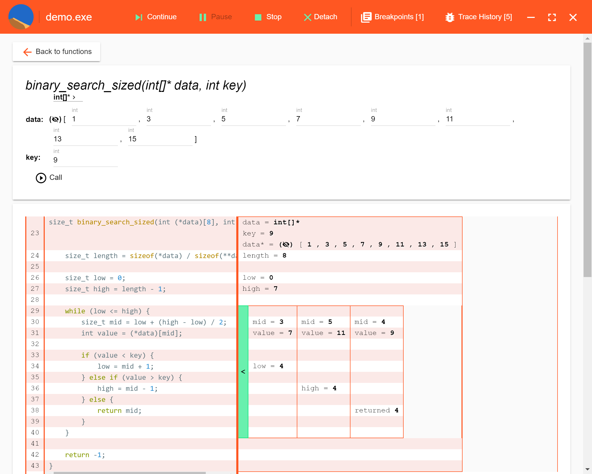
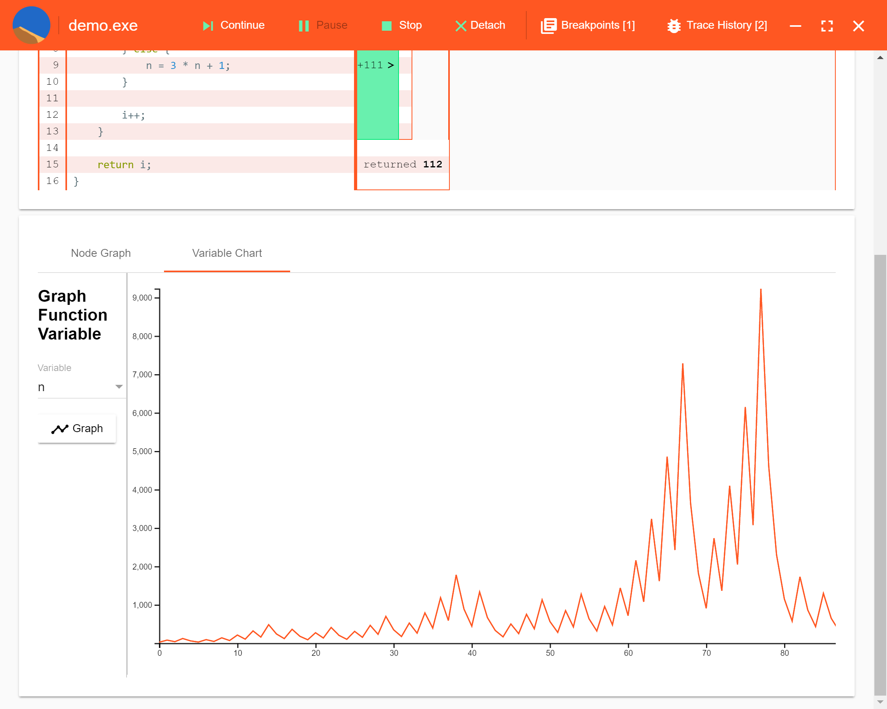

# Using the Spice Debugger

Spice is a debugger designed to work at a high level of abstraction. It collects and manages information about a running program, so you can more easily explore its behavior.

## Getting Started

Spice can debug 64-bit executables with Microsoft debug symbols. It is most heavily tested with C programs, but anything following this format should work. One way to get your program into this format is to compile it using Visual Studio 2015. (Visual Studio 2017 also works as long as the project toolset is changed to `v140`.)

After launching Spice, you can attach to a target program in one of two ways: launching the program from within the debugger, or attaching to an existing process. Spice will then display a list of functions in the target program:

<video controls src="images/tutorial/attach.mp4" width="708"></video>

## Running the Program

At this point Spice provides a list of the functions in your program. Clicking on a function displays the source file the function is defined in, and enables you to start running the program to collect execution traces.

Spice provides two ways to run the program. The first is similar to a traditional debugger- you set a breakpoint, start the program, and let it run until it reaches the breakpoint. The second is more like a REPL- you call a function yourself.

Spice breakpoints are different from traditional breakpoints:
* They work at the level of whole functions, instead of individual source lines.
* Once they're hit, Spice runs the marked function before stopping.

<video controls src="images/tutorial/breakpoint.mp4" width="708"></video>

Calling a function requires that you come up with values for its arguments. You can continue the program normally after calling a function this way, though any changes it makes to the program's state will stick around.

<video controls src="images/tutorial/call.mp4" width="708"></video>

If the function goes into an infinite loop or just takes too long to finish, you can pause it and try something else. Pausing a function run by a breakpoint or a REPL-style call cancels it and Spice will only provide partial data. The program can be restarted with the "Stop" button or closed with the "Detach" button.

<video controls src="images/tutorial/cancel.mp4" width="708"></video>

After collecting several traces, you may need to return to a previous trace to review its results. The "Trace History" menu in the toolbar lists executed functions in chronological order. Selecting one returns you to that trace without re-running it.

## Visualizing Function Traces

Spice provides three main ways to view the traces it collects. A function's control flow and data flow are organized into a table next to its source code. Graphs of objects connected by pointers can be rendered as a collection of connected nodes. Individual variables can be charted over the course of the function's execution.

### Control Flow

A trace contains an entry for each time the program defines or changes a variable. Each change is in the same row as its corresponding line of code. When a line of code is executed multiple times as part of a loop, its entries are organized chronologically into columns:

This display shows the contents of structs and arrays, and the target values of pointers. Large (or infinite) data can be collapsed and expanded as you explore the data in each cell of the trace.

### Object Graphs

Spice can present your program data as a graph of nodes. You can set up the parameters for this visualization before or after running a trace. Select a variable to represent the root node (or an array containing the nodes) and mark which of its fields represent edges in the graph.

The graph visualization has two optional parameters. You can select a field to display on the nodes in the visualization, and you can select a variable representing the current node of a traversal.

<video controls src="images/tutorial/graph.mp4" width="708"></video>

### Variable Charts

The values of a numeric variable can be presented as a chart. This visualization can also be set up before or after running a trace. Spice will automatically scale the chart to fit.

## Ready for More?

Spice is still a new project. If you run into bugs, please file them [here](https://github.com/team-worm/spice). Pull requests are also welcome.

    
    
<small>Image copyright <a href="http://lsgg.deviantart.com/art/DUNE-SIETCH-211570558">LSGG</a></small>

