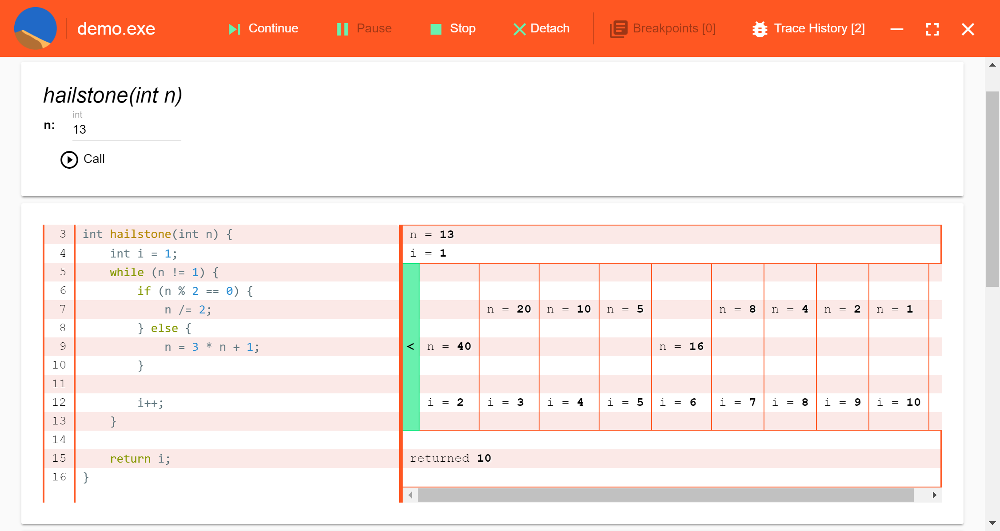
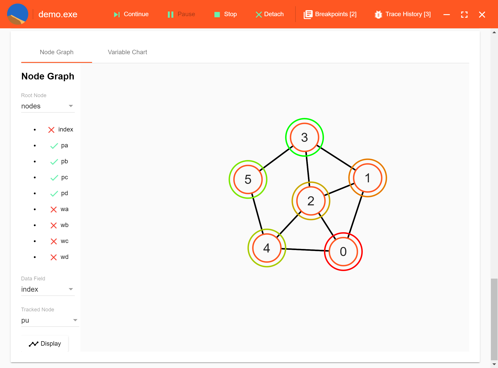
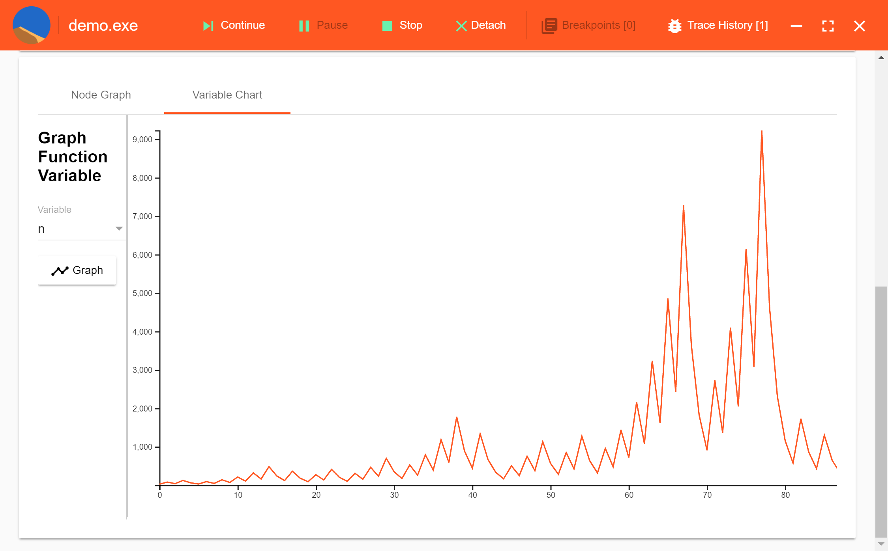

# Debugging That Transcends Time

Spice is an experimental debugger that works across time. Rather than step through a program line by line, Spice traces the execution of a whole function at once, such that altering its arguments immediately shows the corresponding changes in its behavior. Spice visualizes control flow and changes in data structures- for example, the values of variables as they change across loop iterations, the path of a pointer as it traverses a graph, or the motion of array elements as they are sorted.

See every branch, loop, and state change in one view.

Explore data structures visually.

Chart variable values over time.

# The Team

# Tarik Courdy
## Backend web server
* [tarik.courdy@gmail.com](mailto:tarik.courdy@gmail.com)
* [github.com/tcourdy](https://github.com/tcourdy)
* [www.linkedin.com/in/tarikcourdy](https://www.linkedin.com/in/tarikcourdy)

# Elliot Hatch
## Frontend networking and visualization
* [elliot.hatch@gmail.com](mailto:elliot.hatch@gmail.com)
* [neurotischism.com](http://neurotischism.com)
* [www.linkedin.com/in/elliothatch/](https://www.linkedin.com/in/elliothatch/)

# Russell Johnston
## Backend process control and debugging
* [rpjohnst@gmail.com](mailto:rpjohnst@gmail.com)
* [github.com/rpjohnst](https://github.com/rpjohnst)
* [www.linkedin.com/in/russell-johnston](https://www.linkedin.com/in/russell-johnston)

# Sam Davidson
## Frontend UI
* [www.sambdavidson.com](http://www.sambdavidson.com)
* [github.com/samdamana](https://github.com/samdamana)
* [www.linkedin.com/in/samuelbdavidson/](https://www.linkedin.com/in/samuelbdavidson/)

